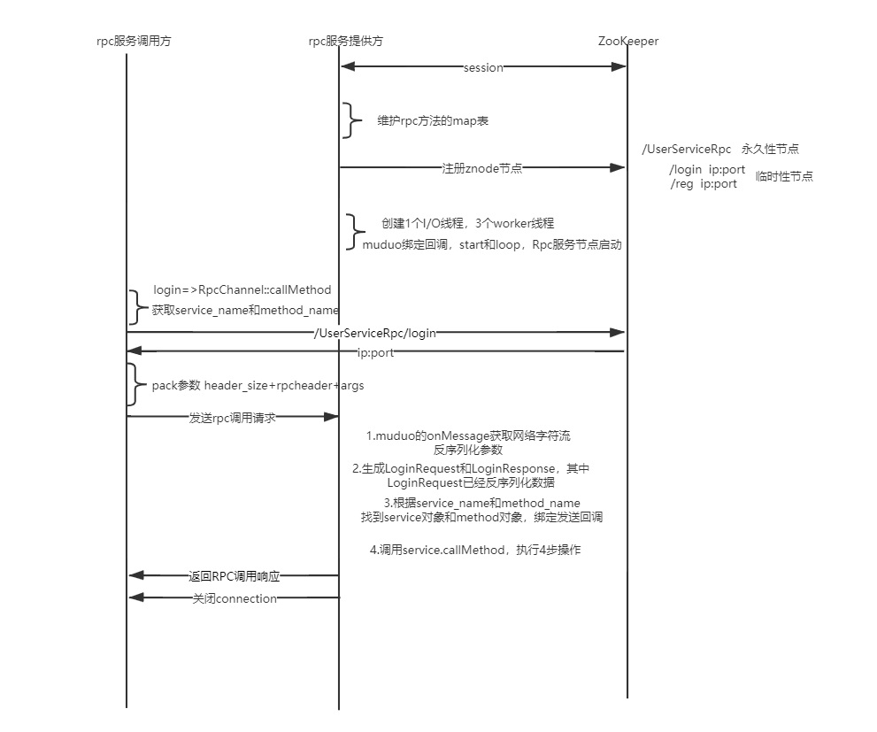

### 项目代码工程目录

bin：可执行文件

build：项目编译文件

lib：项目库文件

src：源文件

test：测试代码

example：框架使用代码范例

CMakeLists.txt：顶层cmake文件

autobuild.sh：自动构建脚本

README.md：项目简介

### protobuf

```protobuf
syntax = "proto3"; //定义语法版本
package  contacts;//包的概念，等价于C++的命名空间

//生成service服务类和rpc服务描述（默认是不生成的）
option cc_generic_services=true;

//枚举类型
enum Color{
    Red=0;//The first enum value must be zero in proto3.
    Blue=6;
}
//定义消息类型，需要序列化目标
message Address{
    int32 num=1;
    bytes addr=2;
}
message Person{

    repeated bytes name = 1; //repeated表示动态数组
    //bytes name = 1; 
    int32 age = 2;
    int32 sex = 3;
    Address addr=4;
    Color color=5;//嵌套类型
}

//定义rpc方法的描述，一个服务类
service RpcFunc{
    rpc Login(Address) returns(Person);

}
```

#### protobuf源码概述

`message` 关键字定义的都是rpc函数调用时的参数和返回值。**提供rpc方法(Callee)**的一端（rpc方法的提供者），通过继承`Service` 类，通过`ServiceDescriptor*` 来对服务进行描述。具体生成的C++代码如下

```c++
class RpcFunc : public ::PROTOBUF_NAMESPACE_ID::Service {
 protected:
  // This class should be treated as an abstract interface.
  inline RpcFunc() {};
 public:
  virtual ~RpcFunc();

  typedef RpcFunc_Stub Stub;

  static const ::PROTOBUF_NAMESPACE_ID::ServiceDescriptor* descriptor();
 //这里以Login作为rpc方法来生成相应的代码
  virtual void Login(::PROTOBUF_NAMESPACE_ID::RpcController* controller,
                       const ::contacts::Address* request,
                       ::contacts::Person* response,
                       ::google::protobuf::Closure* done);
}
```

rpc方法的**调用端(Caller)**，通过继承上述代码中的`RpcFunc` 类(这里的名称是自己在service关键字中定义的)。可以发现调用`Login` 函数，底层都是调用`RpcChannel` 类中的`CallMethod` 方法

```c++
class RpcFunc_Stub : public RpcFunc {
 public:
  RpcFunc_Stub(::PROTOBUF_NAMESPACE_ID::RpcChannel* channel);
  RpcFunc_Stub(::PROTOBUF_NAMESPACE_ID::RpcChannel* channel,
                   ::PROTOBUF_NAMESPACE_ID::Service::ChannelOwnership ownership);
  ~RpcFunc_Stub();

  inline ::PROTOBUF_NAMESPACE_ID::RpcChannel* channel() { return channel_; }

  // implements RpcFunc ------------------------------------------

  void Login(::PROTOBUF_NAMESPACE_ID::RpcController* controller,
                       const ::contacts::Address* request,
                       ::contacts::Person* response,
                       ::google::protobuf::Closure* done);
}

void RpcFunc_Stub::Login(::PROTOBUF_NAMESPACE_ID::RpcController* controller,
                              const ::contacts::Address* request,
                              ::contacts::Person* response,
                              ::google::protobuf::Closure* done) {
  channel_->CallMethod(descriptor()->method(0),
                       controller, request, response, done);
}
```

调用段中的`RpcChannel` 类的源代码如下：

其中有一个`CallMethod` 纯虚函数，在实现时，需要自己定义一个`MyRpcChannel` 类来实现该函数，并通过`RpcChannel` 类指针调用派生类的`CallMethod` 函数（也就是自己定义的处理方式）来执行相应的rpc函数

```c++
class PROTOBUF_EXPORT RpcChannel {
 public:
  inline RpcChannel() {}
  virtual ~RpcChannel();

  // Call the given method of the remote service.  The signature of this
  // procedure looks the same as Service::CallMethod(), but the requirements
  // are less strict in one important way:  the request and response objects
  // need not be of any specific class as long as their descriptors are
  // method->input_type() and method->output_type().
  virtual void CallMethod(const MethodDescriptor* method,
                          RpcController* controller, const Message* request,
                          Message* response, Closure* done) = 0;

 private:
  GOOGLE_DISALLOW_EVIL_CONSTRUCTORS(RpcChannel);
};
```


 ### 项目实现

#### RpcProvider逻辑梳理 

rpc方法的发布方能够通过这个类中的NotifyService方法注册rpc方法（本质上就是记录服务以及服务中的方法的Map映射表）

接着就是等待调用者远程请求rpc方法：

如果网络模块接收到请求数据，回调函数OnMessage会被调用：首先需要将请求数据进行解析，得到请求服务名称、请求方法名称、请求方法参数。RpcProvider和RpcComsumer之间的数据传输需要规定一个协议（这里通过protobuf来定义），只有双方规定一个数据协议，才能从接收到的数据中解析出正确的字段。

这里的数据协议定义为：RpcHeader（header_size（数据头长度，固定4字节）+ service_name（服务名称） + method_name（方法名称） + args_size（参数大小）） +  args_str（函数调用所需的参数）。

因为实现的是框架，不能和具体的业务相联系，所以框架中的指针都需要使用基类指针。其中Callee在proto中定义的服务继承自`google::protobuf::Service` 这个基类，里面的方法包括：

```c++
//调用Caller请求调用的Rpc方法
virtual void CallMethod(const MethodDescriptor* method,
                          RpcController* controller, const Message* request,
                          Message* response, Closure* done) = 0;
//获得Rpc方法对应的请求参数(函数参数)
virtual const Message& GetRequestPrototype(
      const MethodDescriptor* method) const = 0;
//获得RPC方法对应的响应参数(函数返回值)
virtual const Message& GetResponsePrototype(
    const MethodDescriptor* method) const = 0;
```

在callee在proto中定义的`message` ，也就是对应需要序列化的参数，继承自`google::protobuf::Message` ，框架都是通过基类的指针来调用派生类对应方法

**流程总结：** 接收通过网络传输的请求数据，基于RPC自定义的请求数据组成的协议，拆分出对应的信息（比如服务名称、方法名称、方法参数），接着就是构造`google::protobuf::Service::CallMethod`方法需要的参数，然后调用该方法，就完成了调用RPC方法并返回响应参数。


#### RpcChannel逻辑梳理

在rpc方法调用端（caller），需要利用`UserServiceRpc_Stub` 类来完成rpc请求的调用。可以发现`UserServiceRpc_Stub`的构造函数需要传入一个`google::protobuf::RpcChannel` 类，然后由这个类调用`CallMethod` 完成Rpc方法的调用。

```c++
/*
	这里以Login作为rpc方法为例
	当我们在caller端调用Login方法是，实际上内部是由RpcChannel调用CallMethod方法。
*/
void UserServiceRpc_Stub::Login(::PROTOBUF_NAMESPACE_ID::RpcController* controller,
                              const ::UserRequest* request,
                              ::UserResponse* response,
                              ::google::protobuf::Closure* done) {
  channel_->CallMethod(descriptor()->method(0),
                       controller, request, response, done);
}
```

这个`CallMethod` 是一个纯虚函数，需要我们继承基类来重新实现`CallMethod`方法。因为Caller处于Rpc请求的客户端，所以`CallMethod` 的主要作用是将Caller请求的服务名称、方法名称以及方法参数，按照RPC框架自定义的格式进行打包，并通过网络发送给Rpc服务端，由服务端进行实际的Rpc方法调用，也就是`RpcProvider` 的逻辑实现。


#### protobuf作用理解

protobuf相当于是一个中间层的协议，而该rpc是基于protobuf实现的，callee也是基于protobuf发布rpc方法的。因为rpc是一个框架，它是独立于业务的，那该如何调用具体业务的rpc方法的？就是通过基类指针调用派生类方法，在业务实现的proto文件中定义的rpc服务（`service` 关键字），都是继承自`google::protobuf::Service` 的，这个类里面就包含了具体业务的rpc方法。proto文件中定义的消息（`message` 关键字），也就是rpc方法对应的参数和返回值，都是继承自`google::protobuf::Message` 基类的。所以在实现rpc框架的时候，都是通过基类来访问具体业务的派生类方法的，具体实现部分代码如下：

```c++
//获得对应的服务和方法
google::protobuf::Service *curService;
if(serviceMap.count(serviceName)){
    curService=serviceMap[serviceName].m_service;
}else{
    //不存在对应服务
    std::cout<<"Service: "<<serviceName<<" is not exist"<<std::endl;
    return;
}
const google::protobuf::MethodDescriptor *curMethod;
if(serviceMap[serviceName].methodMap.count(methodName)){
    curMethod = serviceMap[serviceName].methodMap[methodName];
}
//获得服务中方法的请求格式和响应格式
google::protobuf::Message *request = curService->GetRequestPrototype(curMethod).New();
google::protobuf::Message *response = curService->GetResponsePrototype(curMethod).New();
```


#### 日志系统

**日志系统逻辑梳理：** 要求实现异步写日志，将要写的内容先存入阻塞队列，由单独的日志写进程负责将内容写入文件。 阻塞队列为生产者消费者模型，利用互斥量和条件变量来临界区资源的正确访问。

通过定义宏来实现简易调用，代码如下：

```c#
#define LOG_BASE(level, format, ...)\
    do{\
        MrpcLogger *log = MrpcLogger::GetInstance();\
        log->Write(level, format, ##__VA_ARGS__);\
        \
    }while(0);

#define LOG_INFO(format, ...) do{LOG_BASE(1, format, ##__VA_ARGS__)}while(0);
#define LOG_DEBUG(format, ...) do{LOG_BASE(2, format, ##__VA_ARGS__)}while(0);
#define LOG_ERROR(format, ...) do{LOG_BASE(3, format, ##__VA_ARGS__)}while(0);
```


#### Zookeeper

RPC服务端通过`MrpcZookeeperClient` 服务的方法对应的服务器的IP+Port添加到zookeeper中。RPC客户端每次要远程调用需要获得服务器的IP+Port时，需要访问zookeeper进行查询。

#### 代码实现逻辑流
